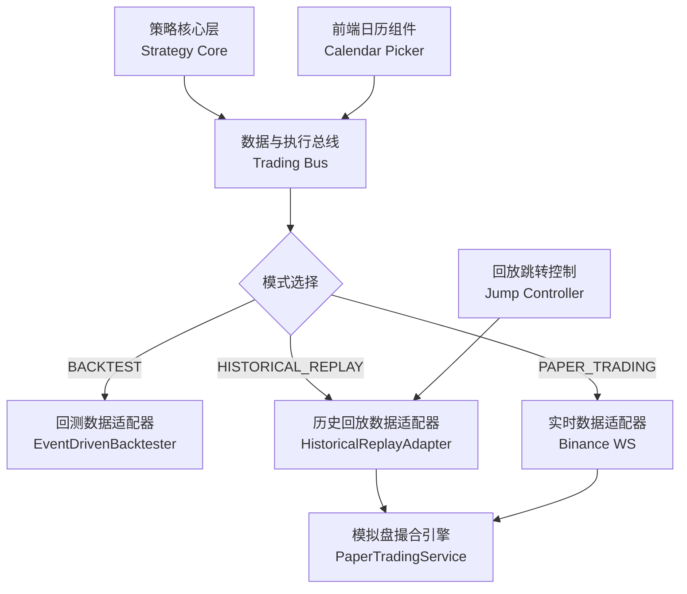

# 历史回放模拟（Historical Replay）功能 SPEC 文档

**文档版本**：v1.0

**编写日期**：2026-03-17

**目标**：在现有 “三位一体” 架构基础上，新增 “历史回放模式”，支持在几分钟内快速回放历史行情，使用模拟盘撮合逻辑执行交易，无需长时间实时运行即可验证策略与归因框架；新增日历式时间选择与回放跳转能力，提升操作灵活性与效率。

&#x20;

## 1. 项目概述

### 1.1 项目背景

当前系统已支持回测（理想成交）与实时模拟盘（需长时间运行）。为快速验证策略在 “接近真实执行环境” 下的表现，需新增一种介于两者之间的模式：**用历史数据的时序推送 + 模拟盘的撮合逻辑**。在此基础上，为降低时间配置门槛、提升精准验证效率，补充日历式时间选择与回放跳转能力。

### 1.2 核心目标

- **快速验证**：支持 1x-100x 倍速回放，几分钟内跑完几天 / 几周的历史行情；
- **逻辑复用**：100% 复用现有的策略核心层、模拟盘撮合引擎、归因分析框架；
- **无缝对比**：支持将 “历史回放结果” 与 “纯回测结果” 进行 QAD 差异归因分析；
- **灵活操作**：通过日历组件可视化选择回放时间范围，支持回放过程中精准跳转到指定历史时间点继续回放。

### 1.3 范围

- 支持股票、期货、加密货币等品种的分钟级 / Tick 级历史回放；
- 支持倍速控制（1x, 10x, 60x, 100x）；
- 支持通过日历组件指定任意历史日期范围（可视化替代手动输入时间戳）；
- 支持回放暂停后跳转到指定历史时间点继续回放；
- 暂不涉及 “订单排队”“交易所优先级” 等超高频细节模拟。

## 2. 核心概念与模式对比

### 2.1 三种模式的定义

| 维度       | 回测模式 (BACKTEST) | 历史回放模式 (HISTORICAL\_REPLAY) | 实时模拟盘 (PAPER\_TRADING) |
| -------- | --------------- | --------------------------- | ---------------------- |
| **数据源**  | 批量读取历史数据        | 时序推送历史数据                    | 实时 WebSocket 行情        |
| **执行逻辑** | 理想成交（假设全成交）     | 模拟盘撮合引擎（支持滑点/部分成交）          | 模拟盘撮合引擎                |
| **时间流速** | 尽可能快            | 可控倍速 (1x-100x)              | 1:1 实时                 |
| **时间配置** | 手动输入时间范围        | 日历可视化选择 + 回放中跳转             | 日历可视化选择 + 回放中跳转        |
| **用途**   | 快速回测策略收益        | 验证执行逻辑与归因                   | 最终上线前验证                |

### 2.2 核心设计原则

&#x20;

- **策略无感知**：策略代码无需任何修改，通过总线自动适配；
- **撮合逻辑一致**：历史回放与实时模拟盘使用**同一套** `PaperTradingService`；
- **归因无缝对接**：历史回放的成交记录自动标记 `mode=historical_replay`，可直接与回测结果做归因对比；
- **操作可视化**：时间配置从 “手动输入时间戳” 升级为 “日历组件选择”，降低操作门槛；
- **回放可跳转**：支持暂停后重置回放起点，精准验证指定时间段的策略表现。

## 3. 架构设计（基于现有 “三位一体” 架构）

### 3.1 架构调整（极小改动）

仅需在总线层新增模式枚举，数据适配器与执行路由器做少量适配；新增日历时间选择的前端交互层、数据适配器游标控制能力。



### 3.2 各层适配逻辑

| 层级                          | 改动内容                                                                                                                                                                                                        |
| --------------------------- | ----------------------------------------------------------------------------------------------------------------------------------------------------------------------------------------------------------- |
| **总线层 (Bus)**               | 1. 在 `TradingMode` 枚举中新增 `HISTORICAL_REPLAY`；2. 新增 `replay_config` 配置项（日期范围、倍速）；3. 新增 `jump_timestamp` 字段，支持接收前端跳转的时间戳。                                                                                     |
| **数据适配器 (DataAdapter)**     | 新增 `HistoricalReplayAdapter`：1. 从 ClickHouse 读取指定日期范围的历史数据；2. 按 `timestamp` 升序排序；3. 实现倍速循环推送逻辑；4. 新增 `set_start_timestamp(timestamp)` 方法，支持重置数据遍历游标；5. 新增 `get_valid_date_range(symbol)` 方法，返回指定品种有数据的日期范围。 |
| **执行路由器 (ExecutionRouter)** | 当模式为 `HISTORICAL_REPLAY` 时：1. 路由到 `PaperTradingService`；2. 将撮合引擎的 “当前时间” 覆盖为历史数据的时间戳；3. 接收跳转指令后，同步更新撮合引擎的 `simulated_time`。                                                                                 |
| **策略核心层**                   | **无需改动**。                                                                                                                                                                                                   |
| **归因分析层**                   | **无需改动**，仅需在查询时支持按 `mode` 筛选。                                                                                                                                                                               |
| 前端交互层                       | 1. 新增日历范围选择器，替代手动时间戳输入；2. 新增 “有效日期” 标注，仅展示有历史数据的日期；3. 新增回放暂停 / 跳转按钮，支持选择指定时间点继续回放；4. 同步展示当前回放的时间位置。                                                                                                         |

## 4. 功能需求

### 4.1 核心功能

| 功能点       | 需求描述                                                                                                                                                              | 验收标准                                                                                   |
| --------- | ----------------------------------------------------------------------------------------------------------------------------------------------------------------- | -------------------------------------------------------------------------------------- |
| 模式配置      | 支持通过 API / 前端配置历史回放参数：1. 策略 ID；2. 开始时间 / 结束时间（支持日历可视化选择，自动转换为 ISO 8601 格式）；3. 回放倍速 (1x, 10x, 60x, 100x)；4. 初始资金；5. 前端可查询指定品种的有效数据日期范围。                            | 1. 配置参数完整保存，无缺失；2. 日历选择的时间自动转换为 UTC 时区的 ISO 8601 格式；3. 可精准筛选出有数据的日期，无数据日期不可选。          |
| 历史数据读取与排序 | 1. 从 ClickHouse 读取指定品种、时间范围的 K 线 / Tick 数据；2. 按 `timestamp` 严格升序排序；3. 处理数据缺失（如某分钟无数据则跳过）；4. 支持按指定时间戳重置数据读取游标。                                                     | 1. 数据读取无报错，排序正确，无逆序数据；2. 调用 `set_start_timestamp` 后，从指定时间戳开始读取数据；3. 跳过无数据的时间片段，无空推送报错。 |
| 倍速时序推送    | 1. 实现循环推送逻辑，逐根调用 `strategy.on_bar()` / `strategy.on_tick()`；2. 支持倍速控制： - 60x：1 分钟的行情间隔 1 秒推送； - 100x：1 分钟的行情间隔 0.6 秒推送；3. 推送时更新总线的 “当前模拟时间”；4. 支持暂停后跳转至指定时间点继续推送。 | 1. 倍速控制准确，推送时序正确；2. 暂停后跳转至指定时间点，从该时间点开始继续推送；3. 跳转后撮合引擎的 `simulated_time` 同步更新。         |
| 模拟盘撮合适配   | 1. 复用 `PaperTradingService`；2. 撮合时使用历史数据的时间戳，而非系统当前时间；3. 支持基于历史行情的滑点模型（可选）。                                                                                       | 撮合逻辑与实时模拟盘一致，时间戳正确。                                                                    |
| 数据持久化     | 1. 所有成交记录、持仓变化、订单记录写入数据库；2. 记录标记 `mode='historical_replay'`；3. 关联 `replay_session_id`（回放会话 ID）；4. 新增 `current_timestamp` 字段，记录回放的当前位置。                            | 1. 数据写入完整，标记正确；2. `current_timestamp` 实时更新，暂停 / 跳转后可恢复。                                |
| 日历时间选择    | 1. 前端展示日历组件，支持选择开始 / 结束日期（精确到分钟）；2. 自动过滤无历史数据的日期；3. 支持快捷选择（近 1 天 / 近 7 天 / 近 30 天 / 自定义）；4. 本地时区显示，提交时自动转换为 UTC 时区。                                               | 1. 日历组件交互流畅，无卡顿；2. 无数据日期置灰不可选；3. 时区转换准确，无时间偏移（误差 < 1 分钟）。                              |
| 回放跳转控制    | 1. 支持暂停回放后，通过日历选择指定时间点跳转；2. 跳转后可继续以原倍速回放；3. 实时展示跳转后的回放进度与 PNL。                                                                                                    | 1. 支持暂停回放后，通过日历选择指定时间点跳转；2. 跳转后可继续以原倍速回放；3. 实时展示跳转后的回放进度与 PNL。                         |

### 4.2 归因分析适配

| 功能点     | 需求描述                                                                                                                                                 |
| ------- | ---------------------------------------------------------------------------------------------------------------------------------------------------- |
| 多模式归因对比 | 1. 归因接口支持指定 `base_mode`（基准模式，通常为 `backtest`）和 `compare_mode`（对比模式，`historical_replay` 或 `paper`）；2. 前端 Analytics 页面支持模式选择器；3. 支持按回放会话 ID 筛选跳转后的回放结果。 |

## 5. 数据模型

### 5.1 新增配置模型

#### 表：历史回放会话表 (`replay_sessions`)

| 字段名                 | 类型                 | 必填 | 说明                                       |
| ------------------- | ------------------ | -- | ---------------------------------------- |
| `id`                | int                | 是  | 主键，自增                                    |
| `replay_session_id` | str                | 是  | 唯一会话 ID                                  |
| `strategy_id`       | int                | 是  | 关联的策略 ID                                 |
| `symbol`            | str                | 是  | 交易品种                                     |
| `start_time`        | datetime           | 是  | 回放开始时间                                   |
| `end_time`          | datetime           | 是  | 回放结束时间                                   |
| `speed`             | int                | 是  | 回放倍速 (1, 10, 60, 100)                    |
| `initial_capital`   | float              | 是  | 初始资金                                     |
| `status`            | str                | 是  | 状态 (pending, running, completed, failed) |
| current\_timestamp  | current\_timestamp | 否  | 当前回放的时间位置（暂停 / 跳转后记录）                    |
| `created_at`        | datetime           | 是  | 创建时间                                     |

### 5.2 现有模型适配

&#x20;

在现有 `orders`、`executions`、`positions` 表中，确保已有 `mode` 字段（枚举：`backtest`, `historical_replay`, `paper`）和 `session_id` 字段，用于关联回放会话；跳转后的成交记录仍关联原 `replay_session_id`，仅 `current_timestamp` 字段更新。

## 6. 接口设计

### 6.1 核心 API 接口

1\. 创建历史回放会话

```Plain

POST /api/v1/replay/create
```

**请求体**：

```JSON

{
  "strategy_id": 1,
  "symbol": "BTCUSDT",
  "start_time": "2026-03-15T00:00:00Z",
  "end_time": "2026-03-16T00:00:00Z",
  "speed": 60,
  "initial_capital": 100000.0
}
```

**响应**：

```JSON

{
  "replay_session_id": "REPLAY_20260317_001",
  "status": "pending"
}
```

#### 2. 启动历史回放

```Plain

POST /api/v1/replay/{replay_session_id}/start
```

**响应**：

```JSON

{
  "status": "running",
  "message": "Historical replay started"
}
```

#### 3. 查询回放状态

```Plain

GET /api/v1/replay/{replay_session_id}/status
```

**响应**：

```JSON

{
  "replay_session_id": "REPLAY_20260317_001",
  "status": "running",
  "current_simulated_time": "2026-03-15T12:30:00Z",
  "progress": 0.52,
  "pnl": 1250.0
}
```

#### 4. 暂停历史回放

Plain

```
POST /api/v1/replay/{replay_session_id}/pause

```

**响应**：

JSON

```
{
  "status": "paused",
  "current_simulated_time": "2026-03-15T12:30:00Z",
  "message": "Historical replay paused"
}

```

#### 5. 跳转历史回放

Plain

```
POST /api/v1/replay/{replay_session_id}/jump

```

**请求体**：

JSON

```
{
  "target_timestamp": "2026-03-15T18:00:00Z"
}

```

**响应**：

JSON

```
{
  "status": "paused",
  "current_simulated_time": "2026-03-15T18:00:00Z",
  "message": "Replay position jumped to target timestamp"
}

```

#### 6. 查询品种有效日期范围

Plain

```
GET /api/v1/replay/valid-date-range/{symbol}

```

**响应**：

JSON

```
{
  "symbol": "BTCUSDT",
  "min_date": "2026-01-01T00:00:00Z",
  "max_date": "2026-03-16T00:00:00Z",
  "valid_dates": ["2026-03-15", "2026-03-16"]
}
```

#### 7. 归因分析接口适配

在现有归因接口中新增 `compare_mode` 参数：

```Plain
GET /api/v1/analytics/attribution/strategy/{strategy_id}?base_mode=backtest&compare_mode=historical_replay&replay_session_id=REPLAY_20260317_001
```

<br />

## 7. 详细实现步骤

### 步骤 1：总线层枚举与配置更新

&#x20;

1. 打开 `backend/app/core/bus.py`；
2. 在 `TradingMode` 枚举中新增 `HISTORICAL_REPLAY = "historical_replay"`；
3. 定义 `ReplayConfig` 数据类，包含 `start_time`, `end_time`, `speed`, `initial_capital`；
4. 在总线配置中新增 `jump_timestamp` 字段，用于接收跳转的目标时间戳；
5. 新增 `current_simulated_time` 字段，实时更新回放的当前时间。

### 步骤 2：实现历史回放数据适配器

1. 在 `backend/app/services/` 下新建 `historical_replay_adapter.py`；
2. 实现 `HistoricalReplayAdapter` 类：
   - 初始化时接收 `ReplayConfig`；
   - 实现 `_load_and_sort_data()` 方法：调用 `ClickHouseService` 读取数据并排序；
   - 实现 `start_playback()` 方法：
     - 循环遍历排序后的数据；
     - 根据 `speed` 计算 `sleep_time` 并休眠；
     - 调用 `bus.publish_bar()` 或 `bus.publish_tick()`；
     - 更新总线的 `current_simulated_time`；
   - 实现 `set_start_timestamp(timestamp)` 方法：重置数据遍历游标到目标时间戳；
   - 实现 `get_valid_date_range(symbol)` 方法：查询 ClickHouse 中指定品种的有效数据日期范围；
   - 实现 `pause_playback()` 方法：暂停数据推送，保存当前遍历游标。

### 步骤 3：适配执行路由器与模拟盘撮合

1. 打开 `backend/app/core/bus.py` 的 `ExecutionRouter`；
2. 修改路由逻辑：当 `mode == HISTORICAL_REPLAY` 时，路由到 `PaperTradingService`；
3. 修改 `PaperTradingService`：
   - 新增 `set_simulated_time(timestamp)` 方法；
   - 撮合时优先使用 `simulated_time`，而非 `datetime.now()`；
   - 接收跳转指令后，同步更新 `simulated_time`。

### 步骤 4：实现 API 接口与持久化

1. 在 `backend/app/api/v1/endpoints/` 下新建 `replay.py`；
2. 实现上述 6.1 节的 7 个核心 API；
3. 实现数据库读写逻辑，保存 `replay_sessions` 记录，新增 `current_timestamp` 字段的更新逻辑；
4. 新增日期合法性校验逻辑：校验选择的时间是否在品种的有效日期范围内。

### 步骤 5：前端适配（日历选择 + 跳转控制）

1. **升级 `DateRangePicker` 组件**：
   - 替换原有的原生 `<input type="datetime-local">` 为基于 `react-day-picker` (Shadcn/UI Popover + Calendar) 的交互式日历组件。
   - **可视化标注**：在日历中通过圆点或背景色高亮有历史数据的日期（数据来源于 `/api/v1/replay/valid-date-range/{symbol}`）。
   - **时区切换与提示**：界面显式标明当前显示的是“本地时区”，在提交请求前统一转换为 UTC ISO 8601 格式。
   - **快捷选择器**：保留并优化“近 1 天/7 天/30 天”快捷按钮。

2. **状态监控面板增强**：
   - **高频更新**：将状态查询频率从 2s 轮询优化为更合适的频率（或考虑 WebSocket），确保进度条滑动平滑。
   - **模拟时间显示**：以 `YYYY-MM-DD HH:mm:ss` 格式高亮展示 `current_simulated_time`，并增加毫秒级跳动动画感。
   - **进度条交互**：进度条不仅展示进度，还应支持鼠标悬停显示对应时间点。

3. **控制指令绑定**：
   - **状态联动**：按钮状态应随后端 `status` 实时切换（如 `running` 时显示“暂停”，`paused` 时显示“继续”）。
   - **跳转逻辑优化**：
     - 点击“跳转”按钮时，弹出专门的 `JumpModal`。
     - `JumpModal` 内置与 `DateRangePicker` 逻辑一致的日历组件，限制可选范围在回放会话的 `start_time` 与 `end_time` 之间。
     - 跳转成功后，自动保持“暂停”状态，由用户决定何时点击“继续”。

4. **异常与边界处理**：
   - **无数据跳转提示**：若用户跳转到的时间点在 ClickHouse 中无数据，前端应弹出 Toast 提示“该时间点无行情数据，将跳转至最近的有数据点”。
   - **会话持久化**：支持刷新页面后，通过 URL 中的 `session_id` 自动恢复对当前回放会话的状态监控。

### 步骤 6：归因接口与前端适配

1. 修改 `attribution_service.py`：支持按 `mode` 和 `session_id` 筛选成交记录；
2. 修改前端 `AnalyticsPage`：新增模式选择器（回测 vs 历史回放 vs 实时模拟盘），支持按回放会话 ID 筛选跳转后的结果。

## 8. 验收标准

### 8.1 单元测试

1. **数据读取与排序测试**：读取 2026-03-15 的 BTC/USDT 分钟级数据，验证排序正确，无逆序；
2. **倍速测试**：设置 60x 倍速，回放 1 小时的数据，验证耗时约 1 分钟（误差 < 10%）；
3. **撮合逻辑一致性测试**：同一信号在历史回放与实时模拟盘（用相同历史数据重放）的成交价格、数量一致（误差 < 0.01 元）；
4. **日历选择测试**：选择无数据的日期，验证前端置灰不可选；选择有效日期，验证自动转换为 UTC 时区的 ISO 8601 格式；
5. **跳转功能测试**：
   - 回放至 2026-03-15T12:30:00Z 后暂停；
   - 跳转到 2026-03-15T18:00:00Z 并继续回放；
   - 验证从 18:00 开始推送数据，撮合时间戳正确，无数据重复 / 丢失。

### 8.2 端到端测试

1. 创建回放会话：通过日历选择 2026-03-15 全天，60x 倍速，`ma_cross` 策略；
2. 启动回放，验证约 24 分钟跑完；
3. 中途暂停回放，跳转到 2026-03-15T14:00:00Z，继续回放；
4. 验证跳转后回放进度从 14:00 开始计算，PNL 计算连续无断层；
5. 去前端 Analytics 页面，选择 “回测 vs 历史回放”，验证：
   - 瀑布图正常渲染；
   - 归因明细表有数据；
   - `delta_price` 和 `delta_fill` 计算正确；
   - 可筛选跳转后时间段的归因数据。

## 9. 后续迭代方向

- 支持基于历史订单簿深度的滑点模型；
- 支持多品种并行回放；
- 支持 “关键时间点标记”：在日历中标记策略触发异常信号的时间点，一键跳转；
- 支持回放进度的 “拖拽式调整”：直接拖拽进度条跳转到指定时间点。

