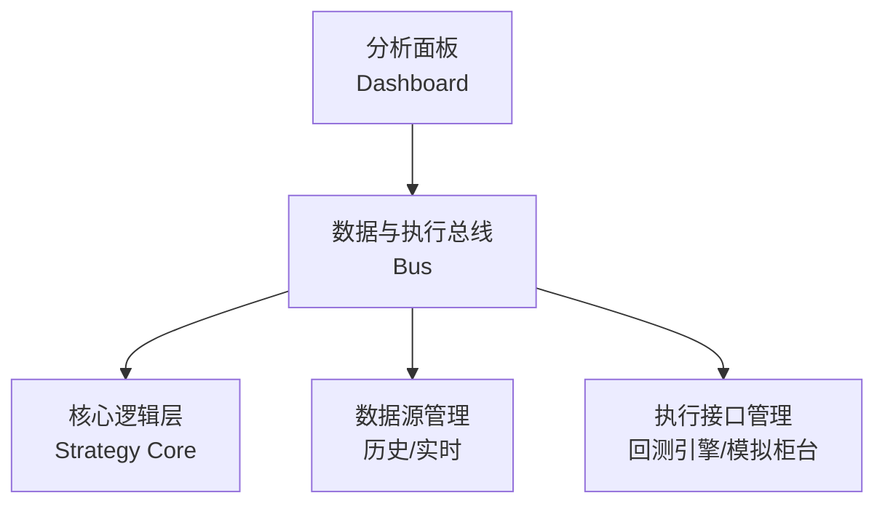

# 量化策略交易系统 SPEC 文档

**系统目标**：在现有基础上构建支持回测与模拟盘无缝对比的成熟量化交易系统，采用“三位一体”架构，确保策略逻辑唯一性、数据/执行自适应切换、差异归因可视化。

## 1. 项目概述
### 1.1 项目背景
量化策略开发中，回测与模拟盘的逻辑割裂、数据/执行差异不透明，易导致“回测漂亮、实盘亏损”。本系统通过统一架构解决上述问题。

### 1.2 核心目标
- **一套代码**：策略逻辑仅维护一份，同时支持回测与模拟盘；
- **无缝切换**：通过中间层自动适配数据源与执行接口；
- **差异归因**：可视化展示回测与模拟盘的收益差异及原因。

### 1.3 范围
- 支持股票、期货等主流品种（初期优先股票）；
- 支持日线、Tick级数据回测与模拟；

## 2. 系统架构
采用“三位一体”分层架构，各层职责清晰、低耦合高内聚。



### 2.1 核心逻辑层（Strategy Core）
- **职责**：唯一的策略信号生成、买卖逻辑、风险管理实现；
- **关键约束**：禁止直接依赖特定数据源或执行接口，所有交互通过总线完成。

### 2.2 数据与执行总线（Bus）
- **职责**：模式切换、数据适配、执行路由；
- **核心组件**：
  - 模式控制器：根据配置切换“回测模式”/“模拟模式”；
  - 数据适配器：统一封装历史数据回放与实时数据推送；
  - 执行路由器：将订单路由至回测引擎或模拟柜台。

### 2.3 分析面板（Dashboard）
- **职责**：绩效展示、差异归因、报告导出；
- **核心展示**：收益曲线对比、归因分析图表、绩效指标矩阵。


## 3. 功能需求
### 3.1 核心逻辑层
| 功能点       | 需求描述                                                                      | 验收标准                                                       |
| ------------ | ----------------------------------------------------------------------------- | -------------------------------------------------------------- |
| 策略接口定义 | 提供标准化策略基类，包含 `on_bar()`、`on_tick()`、`generate_signals()` 等方法 | 策略继承基类后，无需修改代码即可在双模式运行                   |
| 信号生成     | 基于行情数据生成买卖信号（如“买入100手”“平仓50手”）                           | 同一策略在相同历史数据下，回测与模拟盘的信号触发时间、方向一致 |
| 风险管理     | 内置仓位控制、止损止盈逻辑，支持自定义风险规则                                | 触发风险条件时，双模式均能正确执行风控操作                     |

### 3.2 数据与执行总线
| 功能点       | 需求描述                                                                                                 | 验收标准                                           |
| ------------ | -------------------------------------------------------------------------------------------------------- | -------------------------------------------------- |
| 模式切换     | 支持通过配置文件/界面切换“回测模式”/“模拟模式”                                                           | 切换后无需重启系统，策略自动适配新数据源与执行接口 |
| 数据源管理   | - 回测模式：支持历史K线/Tick数据回放（按时间序推进）；<br>- 模拟模式：支持实时行情接入（如券商仿真行情） | 回测数据回放时序准确，模拟行情延迟<100ms           |
| 执行接口管理 | - 回测模式：对接回测引擎，支持理想成交/滑点模型；<br>- 模拟模式：对接券商仿真柜台（如CTP SimNow）        | 回测成交记录与模拟盘报单/成交记录均完整可追溯      |

### 3.3 分析面板
| 功能点       | 需求描述                                                                                                                                                                       | 验收标准                                       |
| ------------ | ------------------------------------------------------------------------------------------------------------------------------------------------------------------------------ | ---------------------------------------------- |
| 收益曲线对比 | 同屏展示回测与模拟盘的净值曲线、累计收益曲线                                                                                                                                   | 曲线支持时间缩放、指标叠加（如基准指数）       |
| 差异归因     | 从以下维度分析收益差异：<br>1. **成交价格差**：回测成交价 vs 模拟盘成交价；<br>2. **成交率差**：回测100%成交 vs 模拟盘部分/未成交；<br>3. **时间戳差**：信号触发与执行的时间差 | 点击某一交易日，可查看当日差异的具体订单及原因 |
| 绩效指标     | 展示年化收益、最大回撤、夏普比率、胜率等核心指标，支持双模式对比                                                                                                               | 指标计算准确，与行业标准一致                   |


## 4. 非功能需求
### 4.1 性能
- 回测速度：处理10年日线数据（约2500根K线）<30秒；处理1个月Tick数据<5分钟；
- 模拟盘延迟：从行情接收至订单报出<200ms（不含网络延迟）。

### 4.2 可靠性
- 数据源断开时自动重连，重连后数据不丢失；
- 订单执行失败时触发告警（界面/日志），并支持手动重试。

### 4.3 可扩展性
- 支持新增策略类型（如套利、高频），无需修改总线层代码；
- 支持新增市场/品种，通过配置文件扩展数据源。


## 5. 接口设计
### 5.1 核心逻辑层 ? 总线接口
```python
# 策略基类示例
class BaseStrategy:
    def __init__(self, bus):
        self.bus = bus  # 注入总线实例
    
    def on_bar(self, bar: BarData):
        """K线数据回调"""
        pass
    
    def on_tick(self, tick: TickData):
        """Tick数据回调"""
        pass
    
    def send_order(self, order: OrderRequest):
        """通过总线发送订单"""
        self.bus.execute_order(order)
```

### 5.2 总线 ? 数据源接口
```python
# 数据适配器接口
class DataAdapter:
    def subscribe(self, symbols: List[str], callback: Callable):
        """订阅行情，回调至策略"""
        pass
    
    def get_history(self, symbol: str, start: str, end: str) -> List[BarData]:
        """获取历史数据（回测用）"""
        pass
```

### 5.3 总线 ? 执行接口
```python
# 执行路由器接口
class ExecutionRouter:
    def execute(self, order: OrderRequest) -> OrderResult:
        """根据模式路由至回测引擎或模拟柜台"""
        pass
```


## 6. 数据模型
### 6.1 行情数据
```python
class BarData:
    symbol: str       # 品种代码
    datetime: str     # 时间戳
    open: float       # 开盘价
    high: float       # 最高价
    low: float        # 最低价
    close: float      # 收盘价
    volume: float     # 成交量

class TickData:
    symbol: str
    datetime: str
    last_price: float # 最新价
    bid_price: float  # 买一价
    ask_price: float  # 卖一价
    bid_volume: float
    ask_volume: float
```

### 6.2 订单数据
```python
class OrderRequest:
    symbol: str
    direction: str   # 买入/卖出
    quantity: float
    price: float     # 限价单价格（市价单可为空）
    order_type: str  # 限价/市价

class OrderResult:
    order_id: str
    status: str      # 已报/部分成交/全部成交/撤销
    filled_quantity: float
    filled_price: float
    timestamp: str
```


## 7. 验收标准
1. **核心逻辑一致性**：同一策略在相同历史数据下，回测与模拟盘的信号触发时间、方向一致性≥99%（因执行差异导致的信号延迟除外）；
2. **模式切换无感知**：切换模式后，策略在10秒内自动适配新数据源与执行接口；
3. **归因分析准确性**：人工构造“滑点2%”“成交率50%”场景，系统能正确识别并归因；
4. **性能达标**：回测10年日线数据<30秒，模拟盘订单延迟<200ms。


## 8. 
- 多策略并行回测与模拟；


